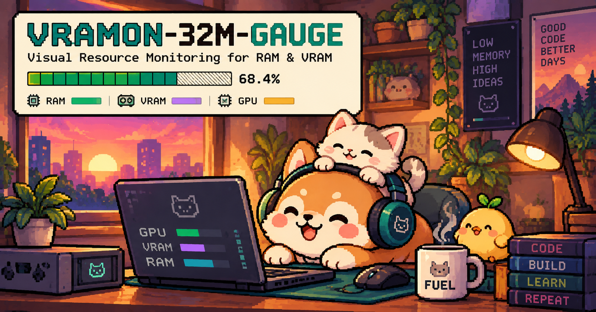

<p align="center">
  
</p>

<p align="center">
  <a href="LICENSE"></a>
  
  
  
  
  
  
  
  
</p>

# VRAMON-32M-GAUGE

**Visual Resource Monitoring for RAM & VRAM**

A tiny, dependency-light Bash utility that turns raw memory statistics into
an immediately readable terminal gauge, a tmux status-bar segment, or JSON.

```text
VRAMON-32M-GAUGE
Visual Resource Monitoring for RAM & VRAM

RAM  [████████████████░░░░]  81.4% free  (13.0 GiB of 16.0 GiB)
VRAM [███████████░░░░░░░░░]  56.2% free  (4.5 GiB of 8.0 GiB)
GPU  [███████░░░░░░░░░░░░░]   37% used

STATUS: HEALTHY
```

- Linux (`free`) and macOS (`vm_stat` / `sysctl`) RAM monitoring
- NVIDIA (`nvidia-smi`) and AMD (`rocm-smi`) VRAM + utilization
- Works without a GPU - falls back to RAM-only mode
- No Python, Node, `jq`, daemons, root access, network or telemetry

## Contents

- [Installation](#installation)
- [Usage](#usage)
- [How headroom is calculated](#how-headroom-is-calculated)
- [Configuration](#configuration)
- [Exit codes](#exit-codes)
- [Project structure](#project-structure)
- [Development](#development)
- [License](#license)

## Installation

```bash
git clone https://github.com/aad1tyaaaaa/VRAMON-32M-GAUGE.git
cd VRAMON-32M-GAUGE
./install.sh            # installs to ~/.local/bin and ~/.local/share/vramon
```

Use `PREFIX=/some/path ./install.sh` for a different location. If
`~/.local/bin` is not on your `PATH`, the installer prints the line to add.

Uninstall with `./uninstall.sh` (configuration in `~/.config/vramon` is kept;
add `--purge` to remove it too).

You can also run it straight from the checkout: `./bin/vramon`.

## Usage

```text
vramon                 one snapshot (same as --once)
vramon --watch         live dashboard, refreshes every 2 seconds
vramon --compact       compact gauges
vramon --tmux          one plain line for tmux status bars
vramon --json          machine-readable output
vramon --no-color      disable ANSI colors
vramon --width 30      gauge width (1-200)
vramon --interval 5    refresh interval for --watch (seconds, decimals allowed)
vramon --help
vramon --version
```

Options combine, e.g. `vramon --watch --compact --interval 1`.
`vramon --json --watch` emits one JSON document per line.

### Compact

```text
RAM  ▰▰▰▰▰▰▰▰▱▱  81%
VRAM ▰▰▰▰▰▱▱▱▱▱  56%
```

### tmux

```text
RAM 81% | VRAM 56%
```

Add to `~/.tmux.conf` (see [examples/tmux.conf](examples/tmux.conf)):

```tmux
set -g status-right '#(vramon --tmux)'
set -g status-interval 2
```

### JSON

```json
{"ram":{"total":17179869184,"used":3195455668,"available":13984413516,"headroom_percent":81.4},
 "vram":{"available":true,"total":8589934592,"used":3762290278,"free":4827644314,"headroom_percent":56.2},
 "gpu":{"available":true,"backend":"nvidia","utilization_percent":37},
 "overall_headroom_percent":56.2,"status":"healthy"}
```

(Printed on a single line. Without a GPU, `vram` fields are `null` and
`"available": false`.)

## How headroom is calculated

```text
RAM_HEADROOM     = available_ram / total_ram * 100
VRAM_HEADROOM    = free_vram / total_vram * 100
OVERALL_HEADROOM = min(RAM_HEADROOM, VRAM_HEADROOM)   # RAM only if no GPU
```

| State  | Overall headroom | Status   |
| ------ | ---------------- | -------- |
| GREEN  | > 30%            | HEALTHY  |
| YELLOW | 10% - 30%        | WARNING  |
| RED    | < 10%            | CRITICAL |

## Configuration

Precedence (lowest to highest): built-in defaults, `~/.config/vramon/config`,
`./.vramonrc`, environment variables, command-line options.

```bash
VRAMON_INTERVAL=2
VRAMON_WIDTH=20
VRAMON_WARN=30
VRAMON_CRITICAL=10
VRAMON_COLOR=1
```

Config files may only contain `KEY=value` lines; they are parsed, never
executed. See [examples/.vramonrc](examples/.vramonrc). `NO_COLOR` is honored,
and colors are disabled automatically when output is not a terminal.

## Exit codes

| Code | Meaning              |
| ---- | -------------------- |
| 0    | Success              |
| 1    | General error        |
| 2    | Invalid argument     |
| 3    | Unsupported platform |
| 4    | Configuration error  |
| 5    | Collector error      |

A missing GPU is never an error.

## Project structure

```text
bin/vramon            CLI entry point and orchestration
lib/platform.sh       OS and GPU backend detection
lib/memory.sh         RAM collectors (free, /proc/meminfo, vm_stat)
lib/gpu.sh            VRAM collectors (nvidia-smi, rocm-smi)
lib/metrics.sh        Headroom calculation and state model
lib/renderer.sh       Full, compact, tmux and JSON renderers
lib/config.sh         Config loading (no eval) and validation
tests/                Fixture-based tests
examples/             tmux.conf and .vramonrc samples
docs/                 Architecture and platform notes
```

## Development

```bash
make test     # fixture-based tests, no GPU/root/network needed
make lint     # shellcheck (optional dev dependency)
make fmt      # shfmt (optional dev dependency)
make run | make watch | make tmux | make json
```

See [docs/architecture.md](docs/architecture.md) and
[docs/supported-platforms.md](docs/supported-platforms.md).

## License

MIT - see [LICENSE](LICENSE).
